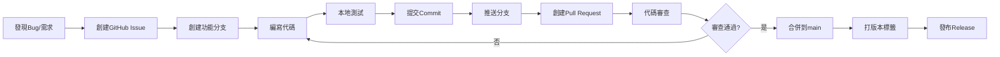

# CI/CD 工作流程指南

本文檔記錄 WebSecScan Platform 的標準 CI/CD 流程，用於 bug 修復、新功能開發和版本發布。

## 📋 目錄

- [工作流程概覽](#工作流程概覽)
- [詳細步驟](#詳細步驟)
- [命名規範](#命名規範)
- [實際案例](#實際案例)
- [最佳實踐](#最佳實踐)

---

## 工作流程概覽

```
發現問題 → 創建Issue → 創建分支 → 修復代碼 → 提交PR → 代碼審查 → 合併 → 打標籤 → 發布
```

### 流程圖



---

## 詳細步驟

### 步驟 1: 創建 GitHub Issue

**目的**: 記錄問題或需求，便於追蹤和討論

```bash
gh issue create \
  --title "bug: 掃描進度顯示「已掃描請求:0」未更新" \
  --body "## Bug 描述
在掃描過程中,前端顯示的「已掃描請求」統計數據始終為 0。

## 重現步驟
1. 訪問 http://localhost:3005
2. 輸入目標 URL 並啟動掃描
3. 觀察掃描進度區域

## 預期行為
應該顯示實際發送的 HTTP 請求數量

## 實際行為
total_requests 始終為 0

## 根本原因
scanner_engine.py 中沒有追蹤 HTTP 請求計數" \
  --label "bug"
```

**Issue 模板要素**:
- 清晰的標題 (使用前綴: `bug:`, `feat:`, `docs:`)
- 詳細的描述
- 重現步驟
- 預期 vs 實際行為
- 根本原因分析 (如果已知)
- 影響範圍
- 優先級標籤

### 步驟 2: 創建功能分支

**目的**: 隔離開發工作，避免影響主分支

```bash
# 確保在最新的 main 分支
git checkout main
git pull origin main

# 創建新分支
git checkout -b bugfix/request-counter-tracking
```

### 步驟 3: 修復代碼

**目的**: 解決問題或實現新功能

**最佳實踐**:
- 保持改動最小化，只修改必要的部分
- 添加必要的註釋
- 遵循現有代碼風格
- 考慮向後兼容性

**本次修復示例**:
```python
# scanner/utils/safe_request.py
class SafeRequestHandler:
    def __init__(self):
        self.timeout = aiohttp.ClientTimeout(total=30, connect=10)
        # 添加請求統計計數器
        self.stats = {
            'total_requests': 0,
            'successful_requests': 0,
            'failed_requests': 0
        }
    
    async def safe_get(self, session, url, **kwargs):
        self.stats['total_requests'] += 1
        try:
            # ... 執行請求
            response = await session.get(url, **kwargs)
            self.stats['successful_requests'] += 1
            return response
        except Exception:
            self.stats['failed_requests'] += 1
            return None
```

### 步驟 4: 提交代碼

**目的**: 記錄變更歷史

```bash
# 添加修改的文件
git add scanner/utils/safe_request.py scanner/core/scanner_engine.py

# 提交並關聯 Issue
git commit -m "fix: 修復掃描進度「已掃描請求」計數器未更新問題 (fixes #1)

- 在 SafeRequestHandler 添加請求統計計數器
- 在每個 HTTP 方法中追蹤請求狀態
- 在 scanner_engine.py 掃描完成後同步統計
- 確保前端能正確顯示實時請求統計數據"
```

**Commit Message 規範**:
```
<type>: <subject> (fixes #issue-number)

<body>

<footer>
```

**Type 類型**:
- `feat`: 新功能
- `fix`: Bug 修復
- `docs`: 文檔更新
- `style`: 代碼格式 (不影響功能)
- `refactor`: 重構
- `perf`: 性能優化
- `test`: 測試相關
- `chore`: 構建/工具配置

### 步驟 5: 推送分支

```bash
git push -u origin bugfix/request-counter-tracking
```

### 步驟 6: 創建 Pull Request

```bash
gh pr create \
  --title "Fix: 修復掃描進度「已掃描請求」計數器未更新問題" \
  --body "## 修復說明

Closes #1

### 問題描述
掃描過程中統計數據始終為 0

### 根本原因
- SafeRequestHandler 沒有追蹤請求統計
- scanner_engine.py 未同步計數數據

### 修復內容
1. SafeRequestHandler 添加 stats 字典
2. 在每個 HTTP 方法中更新計數器
3. scanner_engine 同步統計到結果

### 測試驗證
- ✅ 計數器正確初始化
- ✅ 每次請求更新計數
- ✅ 前端正確顯示數據

### Checklist
- [x] 代碼遵循規範
- [x] 已添加註釋
- [x] 無破壞性變更
- [x] 提交信息清晰" \
  --base main \
  --head bugfix/request-counter-tracking
```

**PR 模板要素**:
- 清晰的標題
- 關聯的 Issue (`Closes #N`)
- 問題描述和根本原因
- 修復內容詳細說明
- 測試驗證結果
- Checklist

### 步驟 7: 代碼審查

**目的**: 確保代碼質量和一致性

**審查要點**:
- [ ] 代碼邏輯正確
- [ ] 無安全隱患
- [ ] 遵循編碼規範
- [ ] 註釋清晰
- [ ] 測試充分
- [ ] 無性能問題
- [ ] 向後兼容

**如需修改**:
```bash
# 在同一分支繼續修改
git add .
git commit -m "refactor: 根據審查意見優化代碼"
git push
```

### 步驟 8: 合併 Pull Request

```bash
# Squash merge (推薦用於 bug fix)
gh pr merge 2 --squash --delete-branch \
  --subject "fix: 修復掃描進度「已掃描請求」計數器未更新 (#1)" \
  --body "在 SafeRequestHandler 和 scanner_engine 中添加請求統計追蹤機制"
```

**合併策略**:
- **Squash Merge**: 多個 commit 合併為一個 (推薦用於 bug fix)
- **Merge Commit**: 保留所有 commit 歷史 (推薦用於 feature)
- **Rebase**: 線性歷史 (需要團隊協調)

### 步驟 9: 打版本標籤

```bash
# 更新本地 main 分支
git checkout main
git pull origin main

# 創建標籤
git tag -a v1.0.1 -m "Release v1.0.1: 修復請求計數器統計

Bug Fixes:
- 修復掃描進度「已掃描請求」計數器未更新問題 (#1)
- 在 SafeRequestHandler 添加請求統計追蹤
- 在 scanner_engine 中同步請求統計到結果

Technical Details:
- 新增 total_requests, successful_requests, failed_requests 計數器
- 每個 HTTP 方法正確追蹤請求狀態
- 確保前端實時顯示準確的請求統計數據"

# 推送標籤
git push origin v1.0.1
```

**版本號規範 (Semantic Versioning)**:
```
MAJOR.MINOR.PATCH

v1.0.0 → v1.0.1  (PATCH: Bug 修復)
v1.0.1 → v1.1.0  (MINOR: 新功能, 向後兼容)
v1.1.0 → v2.0.0  (MAJOR: 破壞性變更)
```

### 步驟 10: 發布 Release (可選)

```bash
gh release create v1.0.1 \
  --title "v1.0.1 - 修復請求計數器統計" \
  --notes "## Bug Fixes
- 修復掃描進度「已掃描請求」計數器未更新問題 (#1)

## Technical Changes
- 在 SafeRequestHandler 添加請求統計追蹤
- 在 scanner_engine 中同步統計數據

## Upgrade Guide
無需特殊操作，直接更新代碼即可。

查看完整 PR: #2"
```

---

## 命名規範

### 分支命名

```
<type>/<short-description>

類型:
- feature/     新功能
- bugfix/      Bug 修復
- hotfix/      緊急修復
- refactor/    重構
- docs/        文檔
- test/        測試

示例:
- feature/add-xss-scanner
- bugfix/request-counter-tracking
- hotfix/critical-sql-injection
- refactor/improve-rate-limiter
- docs/update-api-documentation
```

### Commit Message

```
<type>(<scope>): <subject> (fixes #N)

<body>

<footer>

示例:
feat(scanner): 添加 XXE 漏洞掃描模組 (closes #15)

- 實現 XML External Entity 檢測
- 支持 DOCTYPE 聲明分析
- 添加 payload 測試套件

BREAKING CHANGE: Scanner API 參數格式變更
```

### Issue/PR 標題

```
<type>: <clear description>

示例:
bug: 掃描進度顯示「已掃描請求:0」未更新
feat: 添加 GraphQL 注入掃描支持
docs: 更新部署文檔說明 Docker 配置
refactor: 優化掃描引擎性能
```

---

## 實際案例

### Case 1: Bug 修復流程 (完整示例)

**問題**: 掃描進度「已掃描請求」顯示為 0

```bash
# 1. 創建 Issue
gh issue create \
  --title "bug: 掃描進度顯示「已掃描請求:0」未更新" \
  --body "統計數據始終為 0" \
  --label "bug"
# 輸出: https://github.com/Kobemilly/websec-platform/issues/1

# 2. 創建分支
git checkout -b bugfix/request-counter-tracking

# 3. 修復代碼
# 編輯 scanner/utils/safe_request.py
# 編輯 scanner/core/scanner_engine.py

# 4. 提交
git add scanner/utils/safe_request.py scanner/core/scanner_engine.py
git commit -m "fix: 修復掃描進度「已掃描請求」計數器未更新問題 (fixes #1)

- 在 SafeRequestHandler 添加請求統計計數器
- 在每個 HTTP 方法中追蹤請求狀態
- 在 scanner_engine.py 掃描完成後同步統計"

# 5. 推送
git push -u origin bugfix/request-counter-tracking

# 6. 創建 PR
gh pr create \
  --title "Fix: 修復掃描進度「已掃描請求」計數器未更新問題" \
  --body "Closes #1 ..." \
  --base main \
  --head bugfix/request-counter-tracking
# 輸出: https://github.com/Kobemilly/websec-platform/pull/2

# 7. 合併 PR
gh pr merge 2 --squash --delete-branch

# 8. 打標籤
git checkout main
git pull origin main
git tag -a v1.0.1 -m "Release v1.0.1: 修復請求計數器統計"
git push origin v1.0.1
```

**時間線**:
- Issue 創建: 2025-12-04 10:00
- 分支創建: 10:05
- 代碼修復: 10:10
- PR 創建: 10:20
- PR 合併: 10:30
- 版本發布: 10:35

**涉及文件**:
- `scanner/utils/safe_request.py` (+35 行)
- `scanner/core/scanner_engine.py` (+8 行)

**結果**:
- Issue #1 關閉
- PR #2 合併
- Tag v1.0.1 發布

---

## 最佳實踐

### 1. Issue 管理

✅ **推薦做法**:
- 每個 Issue 只解決一個問題
- 使用標籤分類 (bug, enhancement, documentation)
- 提供詳細的重現步驟
- 關聯相關 Issue 和 PR

❌ **避免做法**:
- 一個 Issue 包含多個不相關問題
- 標題不清晰，如 "修復 bug"
- 缺少重現步驟和環境信息

### 2. 分支管理

✅ **推薦做法**:
- 從最新的 main 分支創建
- 使用描述性分支名
- 及時刪除已合併的分支
- 保持分支生命週期短 (< 3 天)

❌ **避免做法**:
- 長期不合併的分支
- 在分支上做多個不相關的改動
- 分支名不清晰，如 "temp", "test"

### 3. Commit 規範

✅ **推薦做法**:
- 原子性提交 (一個 commit 完成一件事)
- 清晰的 commit message
- 關聯 Issue 編號
- 提交前進行代碼格式化

❌ **避免做法**:
- "WIP", "update", "fix" 等不清晰的 message
- 一個 commit 包含多個不相關的改動
- 提交包含調試代碼或註釋掉的代碼

### 4. Pull Request

✅ **推薦做法**:
- 提供清晰的 PR 描述
- 包含測試結果截圖
- 標記關聯的 Issue
- 自我審查代碼後再提交
- 及時回應審查意見

❌ **避免做法**:
- PR 過大 (> 500 行)
- 缺少描述或測試結果
- 包含與 PR 無關的改動
- 忽略審查意見

### 5. 版本管理

✅ **推薦做法**:
- 遵循語義化版本規範
- 在 tag message 中詳細說明變更
- 維護 CHANGELOG.md
- 重要版本創建 GitHub Release

❌ **避免做法**:
- 版本號混亂
- Tag 缺少說明
- 沒有記錄變更歷史

### 6. 代碼審查

✅ **推薦做法**:
- 審查代碼邏輯和安全性
- 檢查性能和可維護性
- 提供建設性意見
- 及時完成審查 (< 24 小時)

❌ **避免做法**:
- 只關注代碼風格忽略邏輯
- 提供模糊的審查意見
- 長時間不回應 PR

---

## 快速參考

### 常用命令速查

```bash
# Issue 管理
gh issue list                        # 查看所有 Issue
gh issue view 1                      # 查看 Issue #1
gh issue create                      # 創建 Issue
gh issue close 1                     # 關閉 Issue #1

# 分支操作
git checkout -b feature/new-feature  # 創建並切換分支
git branch -d feature/new-feature    # 刪除本地分支
git push origin --delete feature/new-feature  # 刪除遠程分支

# PR 管理
gh pr list                           # 查看所有 PR
gh pr view 2                         # 查看 PR #2
gh pr create                         # 創建 PR
gh pr merge 2 --squash               # Squash 合併 PR

# 標籤管理
git tag                              # 查看所有標籤
git tag -a v1.0.1 -m "Release..."    # 創建標籤
git push origin v1.0.1               # 推送標籤
git tag -d v1.0.1                    # 刪除本地標籤
git push origin --delete v1.0.1      # 刪除遠程標籤
```

### 工作流程檢查清單

#### Bug 修復
- [ ] 創建 Issue 描述問題
- [ ] 從 main 創建 bugfix 分支
- [ ] 編寫修復代碼
- [ ] 本地測試驗證
- [ ] 提交 commit (fixes #N)
- [ ] 推送分支
- [ ] 創建 PR (Closes #N)
- [ ] 代碼審查
- [ ] Squash merge PR
- [ ] 打 PATCH 版本標籤
- [ ] 刪除分支

#### 新功能開發
- [ ] 創建 Issue 描述需求
- [ ] 從 main 創建 feature 分支
- [ ] 編寫功能代碼
- [ ] 添加測試用例
- [ ] 更新文檔
- [ ] 提交 commit (closes #N)
- [ ] 推送分支
- [ ] 創建 PR
- [ ] 代碼審查
- [ ] Merge commit PR
- [ ] 打 MINOR 版本標籤
- [ ] 創建 Release
- [ ] 刪除分支

---

## 附錄

### A. 相關文檔

- [PROJECT_SUMMARY.md](./PROJECT_SUMMARY.md) - 專案開發總結
- [DEVELOPMENT_LOG.md](./DEVELOPMENT_LOG.md) - 開發日誌
- [README.md](./README.md) - 專案說明
- [GitHub Flow](https://guides.github.com/introduction/flow/) - GitHub 工作流程
- [Semantic Versioning](https://semver.org/) - 語義化版本規範
- [Conventional Commits](https://www.conventionalcommits.org/) - Commit 規範

### B. GitHub CLI 配置

```bash
# 安裝 GitHub CLI
curl -fsSL https://cli.github.com/packages/githubcli-archive-keyring.gpg | sudo dd of=/usr/share/keyrings/githubcli-archive-keyring.gpg
echo "deb [arch=$(dpkg --print-architecture) signed-by=/usr/share/keyrings/githubcli-archive-keyring.gpg] https://cli.github.com/packages stable main" | sudo tee /etc/apt/sources.list.d/github-cli.list > /dev/null
sudo apt update
sudo apt install gh

# 登錄認證
gh auth login

# 配置默認倉庫
cd /path/to/repo
gh repo set-default
```

### C. Git 配置

```bash
# 配置用戶信息
git config --global user.name "Your Name"
git config --global user.email "your.email@example.com"

# 配置默認編輯器
git config --global core.editor "vim"

# 配置別名
git config --global alias.co checkout
git config --global alias.br branch
git config --global alias.ci commit
git config --global alias.st status

# 配置默認分支名
git config --global init.defaultBranch main
```

---

## 更新記錄

| 版本 | 日期 | 說明 |
|------|------|------|
| v1.0 | 2025-12-04 | 初始版本，記錄完整 CI/CD 流程 |

---

**維護者**: WebSecScan Team  
**最後更新**: 2025-12-04  
**倉庫**: https://github.com/Kobemilly/websec-platform
